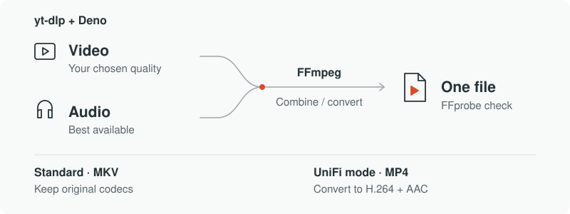

# Rip

Rip is a Windows desktop app for downloading YouTube videos at the quality you choose. It downloads video and audio separately, then combines them into one file. That gives you access to higher resolutions, including 4K, when the source provides them.



## Download a video

1. Paste a video link and choose where to save it.
2. Leave **Highest available** selected, or choose a resolution such as 1080p.
3. Click **Download**.

Standard mode keeps the original codecs and frame rate in an MKV file. A selected resolution sets the maximum quality; Rip never upscales smaller videos.

Enable **UniFi Connect compatibility** to convert to MP4 with H.264 video and AAC-LC audio for Display Cast and Cast Pro. Conversion takes longer.

You can also download audio only. Rip names files after the video title and never overwrites an existing file.

## Under the hood

| Tool | What it does |
| --- | --- |
| yt-dlp | Reads video metadata and available formats, then downloads the selected streams. |
| Deno | Provides the JavaScript runtime yt-dlp uses for YouTube extraction. |
| FFmpeg | Combines streams without re-encoding in standard mode. UniFi mode uses its `libx264` and AAC encoders to produce H.264 video and AAC-LC audio. |
| FFprobe | Inspects the output's streams, container, duration and resolution, plus UniFi requirements, before Rip saves it. |

Rip selects formats for your quality setting and coordinates these tools. Their pinned versions and download sources are in the [tool catalog](src/Rip.App/Setup/tool-bootstrap.json).

## Install and update

Download `Rip-win-Setup.exe` from the [releases page](https://github.com/ElliottHitch/Rip/releases/latest).

`Rip-win-Setup.exe` creates desktop and Start menu shortcuts. First launch downloads and verifies the required media tools. Python is not required. The installer is currently unsigned.

Installed copies check for updates at startup and offer **Update and restart**. The complete update/relaunch flow still needs validation before release.

## Run from source

Install .NET SDK 10.0.400, then run these commands from the repository folder:

```powershell
dotnet restore --locked-mode
dotnet run --project src/Rip.App/Rip.App.csproj
```

`python app.py` also launches the same app if you already have Python installed.

See the [release runbook](docs/release-runbook.md) for installer builds, tests, and automatic GitHub releases.
