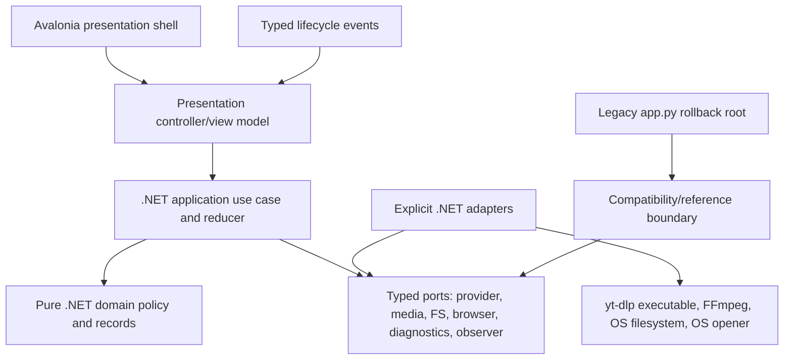

# Downloader ground-up refactor proposal

Status: historical architecture record; current generic defaults and optional compatibility profile are authoritative in README and the implementation
Evidence date: 2026-09-03 UTC
Repository baseline: `agent/download-pipeline-hardening`, HEAD `6d6f65e`
Target release platforms: Windows and Linux, with an explicitly declared support tier

This document records the owner-approved implementation direction and bounded migration plan. It authorizes implementation under the defaults below, but does not itself add application code, dependencies, CI, packaging, UI, or release behavior. The current Python/Tkinter launcher remains a rollback reference during migration; it is not the target GUI, and this proposal does not add a Python GUI, Tkinter, PySide6, or a Python sidecar.

## 1. Executive summary

The downloader has a tested behavioral contract, but `app.py` combines rendering, worker lifecycle, yt-dlp integration, FFmpeg process control, filesystem publication, diagnostics, retry policy, and browser-session privacy in one monolithic module. The proposal is a reversible strangler migration to a non-Python desktop product:

1. Freeze the current contract and security boundaries.
2. Introduce typed .NET domain/application contracts and deterministic tests without changing the legacy launcher.
3. Put yt-dlp, FFmpeg/process execution, filesystem/publication, browser-session access, environment diagnostics, and observability behind explicit adapters.
4. Move orchestration behind a UI-independent .NET application service and typed event stream.
5. Build a thin Avalonia presentation shell over that core, only after an Avalonia spike and Windows/Linux accessibility and process validation.
6. Package native per-platform .NET artifacts with provenance, notices, and rollback evidence; choose exact formats only after clean-install tests.
7. Cut over gradually; remove legacy Python only after parity, release, privacy, and rollback gates pass.

Selected target under the approved defaults: .NET domain/application core + thin Avalonia desktop shell + official pinned yt-dlp standalone executable adapter + explicit FFmpeg process adapter. Avalonia renders its own cross-platform controls; this proposal makes no unsupported claim that its controls are native Win32 or GTK controls. Windows UI Automation, Linux AT-SPI2, process-tree behavior, package behavior, and screen-reader results remain validation gates.

This recommendation explicitly rejects Python GUI frameworks, including the former PySide6 proposal and the current Tkinter shell, as target paths. Tauri 2/Rust remains the strongest contingent alternative if the owner accepts WebView/runtime, TypeScript accessibility, and sidecar-permission complexity; it is not the default merely because Rust is attractive. The stack is chosen by product fit, not Rust/Tauri loyalty.

The recommendation preserves the product/security contract: one YouTube video per request; highest-quality dedicated video/audio yt-dlp operations with one progressive fallback; generic Matroska remux by default and an optional UniFi MP4 compatibility profile; staged non-overwrite publication; progress/activity/cancellation; bounded stream-403 refresh; no automatic 429 recovery; explicit local `cookiesfrombrowser` opt-in; and a separate verified-local-output `Open in Browser` action. No live YouTube request, real browser profile, authentication, package build, screen-reader test, or release action was performed for this proposal.

### Current implementation status

The Phase 2 shell now exists in `src/UnifiDownloader.App`. `Program.Main` starts the Avalonia desktop lifetime for ordinary launches, while `--deterministic-smoke` exits before Avalonia and Infrastructure initialization. The shell has one window with Request, Output, Browser session, Environment, Run controls, Activity, Completion, and status regions. Its typed form supports `Metadata`, `Video`, and `Audio`, one off-by-default `Make output UniFi-compatible` toggle for video runs, default-off per-run browser consent for `Chromium`, `Chrome`, `Edge`, or `Firefox`, safe terminal states, and a separate verified-local-media `Open in Browser` action.

The current App composition loads `unifi-downloader.tools.json` from beside the application binary, or from `UNIFI_DOWNLOADER_TOOL_MANIFEST` when set. The manifest requires schema version 1, HTTPS allow-listed repositories, separate trusted expectations, verified SHA-256 values, and a matching execution RID. Missing or invalid configuration reports safe unavailable capability results and keeps Start disabled. The shell does not download or discover tools remotely. The current `Choose Output Folder` action is wired through Avalonia's `StorageProvider` after `Window.Opened`; it allows one folder and returns only a safe local filesystem path, while the editable output field remains the fallback. The shell gate does not claim live provider or media success, native controls, ARM64 or native Wayland support, packaging, signing, updates, rollback exercise, or release readiness. See [the implementation handoff](phase2-app-shell-implementation.md) and [the tool manifest guide](../tool-manifest.md) for the exact boundary and deferred gates.

### Weighted stack decision matrix

Scores are product-specific engineering judgments from the source-backed re-evaluation, not benchmarks, package-size measurements, or usability test results. Weights total 100; maximum is 500. Runtime/dependency predictability assesses known operational dependencies, not an unbuilt artifact footprint.

| Criterion | Weight | Avalonia/.NET | Tauri 2/Rust + TypeScript | Slint/Rust | egui/Rust | Iced/Rust |
| --- | ---: | ---: | ---: | ---: | ---: | ---: |
| Migration/core fit; non-Python target | 12 | 4 | 4 | 4 | 4 | 4 |
| UX, keyboard, accessibility path | 18 | 5 | 3 | 3 | 3 | 2 |
| Windows/Linux release and native integration | 14 | 5 | 4 | 4 | 3 | 3 |
| Runtime/dependency predictability | 6 | 4 | 3 | 4 | 4 | 4 |
| Typed application/sidecar boundary | 8 | 4 | 5 | 4 | 4 | 4 |
| yt-dlp/FFmpeg process and cancellation fit | 14 | 4 | 4 | 4 | 4 | 4 |
| Privacy, redaction, offline/local-first design | 10 | 4 | 4 | 4 | 4 | 4 |
| Packaging, provenance, update/rollback | 8 | 4 | 5 | 3 | 3 | 3 |
| Licensing/supply-chain clarity | 4 | 5 | 5 | 2 | 5 | 5 |
| Testability and maintenance burden | 6 | 4 | 4 | 4 | 3 | 2 |
| **Weighted result (max 500)** | **100** | **436 (87.2%)** | **396 (79.2%)** | **366 (73.2%)** | **358 (71.6%)** | **334 (66.8%)** |

These totals are arithmetic over the displayed weights and scores. They are decision aids, not measured performance or support guarantees.

### Rationale and alternatives

- Avalonia/.NET leads because official documentation gives the clearest Windows UIA and Linux AT-SPI2 path among the candidates reviewed, while .NET provides typed records/interfaces, process APIs, cancellation primitives, and self-contained deployment options. The score remains conditional on product-specific validation.
- Tauri 2 is the contingent alternative: it offers a strong typed Rust/WebView IPC and sidecar model, capability-scoped shell permissions, and signed distribution tooling. It loses points because Windows requires WebView2, Linux requires system WebKitGTK 4.1 integration, the WebView is not bundled by default, and accessibility depends on the TypeScript/HTML implementation plus the OS WebView.
- Slint is credible and portable, but the reviewed official material did not establish a product-ready Windows/Linux screen-reader path comparable to Avalonia's documented UIA/AT-SPI2 route. Its licensing requires a deliberate review.
- egui is portable and has an AccessKit foundation, but immediate-mode UI leaves more product work for conventional focus, dialogs, keyboard semantics, and screen-reader behavior.
- Iced has a type-safe Elm-style architecture and Windows/Linux support, but the reviewed evidence is less mature for this product's accessibility, packaging, and desktop integration requirements.
- Electron is omitted from the scored set because its Chromium runtime and renderer/main privilege surface add disproportionate operational and security cost for this small local-first utility; it remains rejected unless team constraints materially change.
- Python GUI candidates are rejected by owner direction. The former PySide6/Python recommendation is historical evidence only and must not survive as a target, migration destination, or new dependency.

## 2. Evidence and reconciliation

Tags identify source material and decision status:

- `[ARCH]` architecture audit `t_39ec4f18`, Kanban comment 18: current seams, contracts, ports, and migration risks.
- `[STACK]` product-specific stack re-evaluation `t_8a064d07`, especially Kanban comment 28: matrix, Avalonia recommendation, alternatives, and primary sources.
- `[PKG]` packaging/CI audit `t_ab629c95`, Kanban comment 19: artifact, provenance, FFmpeg, EJS, and release risks.
- `[TEST]` QA strategy `t_05bce57d`, Kanban comment 17: deterministic contract tests, OS matrix, package smoke, and security gates.
- `[UX]` desktop UX audit `t_21126541`, Kanban comments 24 and 25: visual direction and Operate-mode requirements.
- `[DOC]` documentation/migration audit `t_22f1b918`, Kanban comment 20: support tiers, locations, privacy copy, and migration documentation.
- `[UNKNOWN]` intentionally unverified behavior; it is not evidence of support.
- `[DECISION]` an owner-approved default or an explicitly recorded change to the frozen direction.

The specialist inputs reconcile as follows:

| Question | Evidence | Proposal decision |
| --- | --- | --- |
| Presentation framework | `[STACK]` re-evaluation gives Avalonia 436/500 and documents a clearer UIA/AT-SPI2 validation path; `[UX]` requires a calm, keyboardable desktop workspace. | Select a thin Avalonia shell under the approved default. Do not claim native controls; UIA/AT-SPI2 behavior is a gate. |
| Application core | `[ARCH]` and `[TEST]` require UI-independent policy, typed events, fake adapters, and a runnable legacy path. | Use a .NET domain/application core with immutable records, interfaces, and explicit composition; no UI references in core. |
| yt-dlp boundary | `[STACK]` says direct Python embedding is unavailable in a .NET/Rust target and recommends the official standalone executable. | Launch a pinned official per-platform yt-dlp executable with a typed process adapter and no shell interpolation. Separate metadata, video, and audio operations. |
| EJS/JavaScript runtime | `[STACK]` records current yt-dlp EJS guidance and Deno requirements. | Make EJS/Deno ownership an ADR and clean-install gate. Do not silently fetch remote components. |
| FFmpeg | `[PKG]` flags GPL/LGPL configuration, redistribution, and provenance as decisions. | Use an explicitly diagnosed external/system FFmpeg prerequisite initially. Bundling requires owner/legal/provenance approval. |
| Packaging | `[PKG]` requires per-target builds, clean-install smoke, notices, checksums/SBOM, signing, and rollback. | Implement the self-contained per-target packaging shape; finalize exact formats and release evidence only after the spike. Do not claim a package build or size here. |
| Migration | `[ARCH]` and `[DOC]` require no big-bang cutover. | Keep `app.py` runnable as rollback reference while .NET contracts, adapters, shell, and release lanes are built. |
| Privacy | Existing behavior and `[TEST]` require opt-in browser access, no export/persistence, and redaction through exception chains and locals. | Keep browser access and local opening as separate ports; no cookies, profile paths, signed URLs, or child diagnostics cross the safe boundary. |
| UX direction | `[UX]` specifies Taste dials and Impeccable Operate-mode states. | Preserve the quiet, dense, keyboard-first direction in Avalonia without making it a web landing page or asserting untested behavior. |

## 3. Current-state inventory

The following is observed in the post-gate checkout, not proposed structure.

### Files and runtime ownership

- `app.py:1-25` imports Python standard library, Tkinter, `webbrowser`, and optional `yt_dlp`; missing yt-dlp remains reportable to the preserved launcher. `requirements.txt:1-2` pins `yt-dlp==2026.8.19`. This is the rollback/reference path, not the target GUI. The target shell uses the pinned .NET/Avalonia projects described above. [ARCH] [DOC]
- `app.py:27-34` owns FPS, bitrate, 5 GiB, retry, and FFmpeg cancellation constants. `app.py:35-150` owns browser list, supported-name mapping, consent text, platform rejection, and `cookiesfrombrowser` option construction.
- `README.md` documents the target shell entry point and its one-window controls, typed operation and FPS choices, browser-session consent, local opening, publication behavior, and deferred gates. It retains the Python suite as a compatibility check and `app.py` as rollback/reference. [DOC]
- The proposal's original baseline contained no package metadata, lockfile, installer manifest, CI workflow, license/NOTICE inventory, changelog, configuration schema, or support-diagnostics format. The later implementation adds the .NET solution, project files, package locks, Core, Infrastructure, App, tests, and an unsigned packaging workflow; it does not add a signed release package or installer. [PKG] [DOC]

### Responsibilities in `app.py`

- `app.py:86-186`: domain exceptions, browser option construction, browser setup classification, non-empty MP4 verification, and local file URI conversion.
- `app.py:189-235`: metadata error messages, URL/query redaction, HTTP status parsing, and diagnostic truncation.
- `app.py:238-317`: environment status, filename policy, human-readable sizes, FFmpeg/NVENC probing, and target FPS.
- `app.py:320-414`: video/audio format filtering and ranking, passthrough decision, FFmpeg timestamp parsing, and unique output path generation.
- `app.py:417-451`: root/window setup, default output path, environment probe, cancellation/process/thread state, browser consent state, and completed-output state.
- `app.py:454-582`: theme, widget, layout, progress, status, environment, and Activity Log construction.
- `app.py:585-834`: folder picker, browser consent modal, browser controls and reset, verified-output gate, local open action, status/progress/log marshaling, environment dialogs, and OS-specific folder opening.
- `app.py:837-909`: validation, environment gating, destination creation, browser option capture, control locking, worker creation, and cancellation.
- `app.py:911-1000`: temp-directory lifecycle, retry-visible state, publication verification, expected/unexpected error mapping, cleanup warning preservation, retry controls, and reset ordering.
- `app.py:1011-1100`: yt-dlp metadata extraction, playlist rejection, format selection, browser-option propagation, and sanitized browser/setup error conversion.
- `app.py:1102-1256`: two application attempts, cancellation-aware backoff, bounded stream-403 refresh, no application-level 429 refresh, yt-dlp stream options, progress hooks, and stream-output checks.
- `app.py:1258-1353`: `subprocess.Popen` with argument vectors, merged UTF-8-replacement output, reader queue/thread, progress parsing, and terminate-then-kill cancellation.
- `app.py:1355-1407`: legacy remux command construction, same-destination staging, hard-link publication, and collision retry. The runnable legacy path remains the rollback reference; the verified target publisher is documented below.
- `app.py:1409-1555`: transcode policy, NVENC-to-x264 fallback, size warning, publication, and staged-file cleanup.
- `app.py:1557-1560`: the only current composition root: construct Tk root/app and enter `mainloop`.

### Tests and coupling hotspots

`tests/test_pipeline.py` has 39 deterministic compatibility tests covering format selection, browser options and errors, traceback-local hygiene, consent state, 403/429 semantics, playlist rejection, output verification, retry UI, progress, cancellation, diagnostics, staging, FFmpeg failure/cancellation, and a stubborn child process. It does not prove real yt-dlp service behavior, browser/keyring/profile locking, real-media semantics, FFprobe validation, Windows process/filesystem behavior, default handlers, clean packages, installers, or startup. These are explicit gaps, not reasons to weaken the deterministic gate. [TEST]

1. `app.py` is the primary collision hotspot: UI, orchestration, provider, process, filesystem, browser state, and diagnostics all meet there.
2. `app.py:911-983` couples temp lifetime, retry-visible state, publication truth, UI callbacks, error conversion, and reset ordering.
3. `app.py:1102-1150` couples metadata resolution, stream retry policy, temp cleanup, cancellation, and browser option lifetime.
4. `app.py:1409-1555` couples media policy, FFmpeg commands, encoder fallback, staging, publication, warnings, and cleanup.
5. `app.py:424-447`, `880-907`, `1102-1132`, and `1210-1250` share mutable cross-thread browser/process/cancel state.
6. `tests/test_pipeline.py:108-140` and `152-739` couple tests to module globals, private methods, and shared fake state.

These are deliberately preserved hotspots for later decomposition. This proposal changes none of them.

## 4. Preserved product and security contracts

These are compatibility requirements, not optional implementation details. Any intentional change needs an owner decision record and release note.

- One request resolves exactly one video; playlists and multi-video extractor results fail clearly.
- Metadata resolution and video/audio stream downloads remain separate yt-dlp operations.
- Generic output is Matroska when possible; the optional UniFi profile targets MP4 with H.264 High/yuv420p, AAC stereo at 192 kbps, an allowed 24/25/30 FPS target, 40 Mbps video, and 46 Mbps maximum rate. Remuxed streams may retain unchecked source properties. The five-GiB staging bound is enforced before/post download, while final compatibility warnings remain explicit. [DOC]
- Output is staged before publication and must be non-empty before it is considered complete. The verified target publisher rejects an existing destination without overwrite or collision suffixes, copies the owned source to a private temporary file in the selected destination, verifies the positive exact length, and commits with a same-directory non-overwriting rename before re-verifying the final file. This is not a universal whole-operation atomicity guarantee, and hard-link support is not claimed. [ARCH] [DOC]
- Completion is reported only after publication and exact final-path verification. `Open in Browser` rechecks the path and opens only an encoded local `file://` URI.
- Stream HTTP 403 permits one fresh metadata/format resolution after a bounded, cancellation-aware wait; no more. Metadata 403 is not a stream retry. HTTP 429 has no application-level automatic recovery. yt-dlp's own bounded retry settings remain distinguishable from app policy.
- Cancellation is truthful: failed/cancelled work is not presented as complete; cancellation after publication preserves and reports the output; cleanup failure is a warning, not a false failure.
- Browser-session access is off by default, consent-gated per download, uses only yt-dlp's supported local `--cookies-from-browser` option, locks while running, and clears consent, browser, profile, and option state after success, failure, or cancellation.
- The app never asks for a password, automates login or CAPTCHA, exports or writes cookie files, persists/uploads browser data, runs a remote bridge, rotates proxies, spoofs fingerprints/headers, or bypasses service restrictions.
- Browser-session access and local post-download opening are separate ports and separate UI permissions. Opening a verified local media file never calls yt-dlp, network, browser-session, or retry code.
- Logs, status, dialogs, retained errors, exception causes/contexts, traceback locals, and future diagnostics must not retain cookies, profile paths, signed URLs, tokens, authorization values, or raw upstream browser diagnostics.

## 5. Recommended target architecture (approved selection)

### Dependency direction



The arrow direction is dependency direction: domain imports no UI, process, yt-dlp, browser, or filesystem implementation; application imports domain and ports; adapters implement ports; the shell consumes events and invokes use cases; the composition root selects concrete adapters. The current Python launcher is retained only as a rollback/reference path, not as a new sidecar or target GUI. No Python GUI or Python sidecar is hidden in this design. [ARCH] [TEST]

### Proposed module tree

```text
src/UnifiDownloader.Core/
  Domain/
    DownloadRequest.cs          // immutable request and browser-session value objects
    MediaModels.cs              // metadata, stream, media-plan, output records
    Policies.cs                 // format, filename, FPS, target, retry decisions
    Errors.cs                   // safe error codes/messages
    StateReducer.cs             // lifecycle transition rules
  Application/
    DownloadVideo.cs            // one-video use case; no Avalonia references
    Events.cs                   // typed event definitions and redaction boundary
    Cancellation.cs             // run identity and cancellation contract
    Ports.cs                    // explicit provider/media/FS/browser/diagnostics interfaces
src/UnifiDownloader.Infrastructure/
  Composition.cs                // concrete wiring and capability policy
  Adapters/
    YtDlpExecutableAdapter.cs   // pinned executable, argv, allowlisted output, classification
    FfmpegProcessAdapter.cs     // argv, output reader, cancellation, exit classification
    FilesystemPublisher.cs      // temp, staging, verification, collision-safe publication
    BrowserSessionAdapter.cs    // consent and supported cookies-from-browser argument
    LocalFileOpener.cs          // verified local media only
    EnvironmentDiagnostics.cs   // PATH/runtime/process capability checks
    RedactedObserver.cs         // safe event/log sink
src/UnifiDownloader.App/
  App.axaml                    // presentation resources only
  Views/DownloadView.axaml     // thin Avalonia controls and labels
  ViewModels/DownloadViewModel.cs
  PresentationController.cs    // command binding and event mapping
  Accessibility.cs             // names, focus, status announcements
legacy/
  app_adapter.py                // temporary rollback/compatibility reference only
```

Package metadata and lock inputs exist for the current implementation, and the repository now documents unsigned self-contained per-target publish commands. It does not yet prove native runtime behavior, signed release artifacts, installers, update/rollback behavior, or publication. The tool manifest and its provenance evidence remain explicit operator/release inputs; the app does not fetch missing components at runtime.

### Typed contracts

The following are implementation-level shapes, not code authorized by this task. C# names may be finalized in an ADR, but the responsibilities and information-flow restrictions are fixed.

```csharp
public sealed record DownloadRequest(
    Uri SourceUrl,
    string Destination,
    BrowserSession? BrowserSession);

public sealed record BrowserSession(
    SupportedBrowser Browser); // typed browser kind only; never logged as provider data

public interface IDownloadProvider
{
    Task<MediaSelection> ResolveAsync(
        ResolveRequest request, CancellationToken cancellation);

    Task<DownloadedStream> DownloadStreamAsync(
        StreamSelection selection, string destination,
        IProgressSink progress, CancellationToken cancellation);
}

public interface IMediaExecutor
{
    Task ExecuteAsync(
        LocalStreams streams, MediaPlan plan, string stagedOutput,
        IProgressSink progress, CancellationToken cancellation);
}

public interface IPublisher
{
    StagedOutput CreateStage(string destination);
    VerifiedOutput Verify(string path);
    PublishedOutput Publish(StagedOutput stage, string title);
}

public interface IBrowserSessionProvider
{
    ProviderArguments BuildArguments(BrowserSession? session);
}

public interface ILocalFileOpener
{
    Task<OpenResult> OpenVerifiedAsync(VerifiedOutput output);
}
```

Additional ports are `IEnvironmentDiagnostics.ProbeAsync`, `IObserver.Emit`, `IClock.DelayUntilCancelledAsync`, and `IProcessRunner.RunAsync`. No port returns cookie values, raw extractor exceptions, browser database paths, signed URLs, widget objects, or unrestricted child output. The provider owns yt-dlp argument and output translation; the process adapter owns executable invocation and process-tree handling; the publisher owns same-destination non-overwrite behavior.

### Events, state, and errors

Every request gets an opaque `RunId` for stale-event rejection and correlation only; it is never a source URL or profile identifier. The application emits a closed set of typed events:

```text
RunStarted(run_id)
ValidationAccepted(run_id)
ConsentRequired(run_id)                 // UI-only; no provider access
EnvironmentChecked(run_id, capabilities)
StageChanged(run_id, stage)
ProgressChanged(run_id, mode, value, bytes_done, bytes_total, duration)
ActivityRecorded(run_id, safe_code, safe_message)
RetryScheduled(run_id, stage, reason=stream_403, attempt, max_attempts)
PublicationVerified(run_id, path_token, size, compliance)
RunCompleted(run_id, output, compliance, warning)
RunCancelled(run_id, published_output_preserved)
RunFailed(run_id, stage, error_code, retry_action)
RunReset(run_id)
```

Paths in events are omitted, represented by a display-safe basename/token, or carried only to the local opener after verification. `ProgressChanged` supports determinate and indeterminate modes; no percentage is fabricated when source size/duration is unknown. Terminal events stop progress and invalidate prior run events.

Errors have a stable safe code, stage, user message, retry action, and separately retained redacted diagnostic. Examples are `metadata_access_denied`, `metadata_rate_limited`, `stream_forbidden_refresh_exhausted`, `stream_rate_limited`, `browser_session_unavailable`, `ytdlp_executable_unavailable`, `ejs_runtime_unavailable`, `ffmpeg_start_failed`, `ffmpeg_failed`, `publication_collision`, `publication_verification_failed`, `cancelled`, and `cleanup_warning`. Exception causes and contexts are cleared or sanitized before any terminal error crosses the application boundary. [TEST]

### Concurrency and cancellation

- The application owns one active run per window. A run token and monotonically increasing generation prevent late worker events from changing a newer run's controls.
- The application service never calls Avalonia controls. It writes typed events to a channel/queue; the presentation event loop consumes them on the UI thread.
- `CancellationToken` is checked before resolve, before each stream, during progress hooks, during backoff, before media execution, during process output, and before publication.
- Cancellation during a network call is bounded by the adapter's configured socket timeout; the UI says this plainly. Backoff uses an injected monotonic clock/sleeper, not arbitrary sleeps in core tests.
- The .NET process adapter uses `ProcessStartInfo.ArgumentList`, `UseShellExecute=false`, redirected streams, asynchronous reads, and platform-specific process-group/job handling. `WaitForExitAsync(CancellationToken)` and `Process.Kill(entireProcessTree: true)` are candidate primitives, not proof of complete descendant cleanup; yt-dlp-to-Deno and FFmpeg descendants must be tested separately on Windows and Linux.
- On cancellation, cooperative termination is attempted, then escalation after a bounded grace period. The adapter returns a classified cancellation and clears the active process handle before terminal event emission.
- Publication is the commit point. Cancellation before publication leaves no exposed final output; cancellation after publication preserves the verified output and emits `RunCancelled(published_output_preserved=true)` or the equivalent completed-warning state.

## 6. yt-dlp executable, EJS/Deno, and process boundaries

### Official executable adapter

Direct Python yt-dlp embedding is not part of the .NET target. Use the official, version-pinned, per-platform standalone yt-dlp executable (`yt-dlp.exe` on Windows and the corresponding official Linux artifact) as an explicit adapter dependency. Obtain release artifacts only through the approved provenance process; do not infer a release asset hash or package behavior here.

The adapter must:

1. Resolve the executable from an explicit, verified application-owned location or a documented external prerequisite.
2. Launch with `ProcessStartInfo.ArgumentList`, `UseShellExecute=false`, no shell interpolation, and redirected stdout/stderr.
3. Execute separate metadata resolution, video stream, and audio stream operations. Preserve one-video rejection and the existing format policy.
4. Use an allowlisted machine-readable/progress surface. Parse only expected fields and bounded progress lines; avoid `--verbose` in normal operation.
5. Never log raw argv, source URLs, signed stream URLs, cookies, profile paths, authorization values, or unfiltered child diagnostics.
6. Map exit codes and sanitized status markers to safe typed errors. Keep app-level policy distinguishable from yt-dlp's bounded internal retries.
7. Return local staged stream paths only to the media adapter; never pass a browser-session object or remote URL to FFmpeg.

A Python yt-dlp sidecar is not the target: it would preserve the rejected runtime boundary and multiply packaging, process, and redaction surfaces. It may be discussed only as a rejected fallback in an ADR; it must not be smuggled into the Avalonia/.NET design.

### EJS and Deno ownership

The current yt-dlp EJS guide says YouTube support may require `yt-dlp-ejs` and an external JavaScript runtime, recommends Deno with a stated minimum version, and documents explicit `--js-runtimes` configuration. Official standalone executables bundle the EJS component according to that guide. The approved default is a diagnosed, pinned runtime path in development and runtime environments; a release spike may package a versioned Deno runtime alongside the official executable only after license, provenance, permission, and clean-install checks. Missing runtime is a truthful capability error, not an implicit download or fallback.

The selected release must not enable `--remote-components ejs:npm` or `ejs:github` as an implicit runtime fetch. A clean-install smoke test must prove executable discovery, EJS/Deno capability diagnosis, restricted runtime permissions, and offline/local-first behavior. The exact Avalonia patch, Deno artifact/license inventory, and release packaging are validation/release gates, not unresolved target selection. No live service test is authorized by this proposal.

### FFmpeg process adapter

FFmpeg remains a separate explicit process adapter. It receives already-selected local stream paths and a typed `MediaPlan`; it never receives a URL or browser-session object. It constructs exact remux/transcode argv, validates executable path/version, parses bounded output, classifies return codes, supports cancellation, and writes only into staged output.

The initial release candidate is an external/system FFmpeg prerequisite with a clear environment diagnostic. Bundling later requires an owner and legal decision covering exact source, version, configure flags, architecture, hash, notices, source-offer obligations, patent policy, security update owner, and update cadence. FFmpeg's official legal page distinguishes the LGPL baseline from GPL builds and additional nonfree restrictions; the host's observed GPL-enabled configuration cannot be copied into a release by assumption. FFprobe remains diagnostic initially; semantic validation is a separate owner decision.

## 7. Side-effect, filesystem, browser, and redaction boundaries

### Filesystem and publication

| Data | Current observed behavior | Target proposal |
| --- | --- | --- |
| Published media | User-selected directory; default `~/Videos/Unifi Downloads` | Preserve default for compatibility; any setting requires an explicit schema decision. |
| Worker temp | OS temp directory, `unifi_dl_` prefix | Injected temp provider, run-scoped cleanup, diagnostics without full paths. |
| Destination staging | Legacy hidden `.unifi_dl_*.mp4` and same-destination hard link | Target publisher uses a private destination temp file and same-directory non-overwriting rename; define and test broader filesystem support before claiming equal release support. |
| Configuration | None today | No persistence until owner approves schema, migration, permissions, and secret-free contents. |
| Activity log | In-memory Tk text widget | In-memory redacted typed event stream; any export requires retention and redaction approval. |
| Browser options | In-memory per run and reset after completion/failure/cancellation | Preserve exactly; never write browser, profile, cookie, keyring, or session values. |
| Cache/database | None today | None in the first refactor without a measured requirement and owner decision. |

Use platform path APIs, not string concatenation. Define Windows reserved names, trailing dot/space behavior, long-path policy, UNC paths, symlink policy, case-insensitive collisions, network/FAT/exFAT behavior, and permission failures before claiming equal release support. The verified local publisher uses a private destination temp file and a same-directory non-overwriting rename. Broader filesystem/platform behavior, crash semantics, and any future hard-link or fallback choice remain release gates. Never call the behavior universally atomic without proving the OS/filesystem matrix.

### Browser-session privacy

The browser adapter accepts a typed, user-selected browser only after explicit per-run consent. It validates support and returns only the exact allowlisted `--cookies-from-browser` argument shape. It does not accept an application-supplied profile path, discover, export, copy, persist, upload, or display cookies or browser database contents. The default path must not inspect browser data at all.

Controls lock during a run, and consent, browser, and argument state clear after success, failure, or cancellation. No password form, login/CAPTCHA automation, cookie-file export/persistence/upload, remote browser bridge, proxy rotation, fingerprint/header spoofing, service bypass, or live-auth workaround exists in the target.

The local opener is separate from yt-dlp and browser-session adapters. It takes only a freshly verified non-empty local MP4, rechecks existence/readability immediately before launch, and passes an encoded local URI to the OS handler. It has no network, retry, or session capability.

### Observability and redaction

Record only safe stage/error codes, app/refactor version, OS/architecture, runtime/dependency versions, capability outcomes, attempt number, cancellation state, output-size category, and sanitized guidance. Scrub source URLs and query values, home/destination/profile paths, browser/session identifiers, cookies, authorization/token/signature fields, raw yt-dlp/browser messages, exception chains, and traceback locals. Use synthetic sentinels in tests only; never place real profiles or credentials in fixtures. The Activity Log is not a support bundle. `[TEST] [DOC]`

## 8. Windows/Linux UX and accessibility

### Design direction

Design Read: “Operate-mode desktop downloader for technically capable but trust-sensitive users: calm utilitarian dark-tool language with native system UI, editorial hierarchy, and restrained industrial materiality.” `[UX]`

Taste dials: `DESIGN_VARIANCE=3`, `MOTION_INTENSITY=2`, `VISUAL_DENSITY=5`. The result is a quiet tool with modest visual character, low motion, and information-rich but scannable density; it is not a marketing landing page.

- Use a restrained dark surface, one amber action/accent, and semantic green/amber/red status colors with sufficient contrast; status color is never the only signal.
- Establish a clear type scale and platform-resolved system font stack; do not hard-code Segoe UI universally.
- Prefer predictable Avalonia controls, platform file dialogs, keyboard focus rings, and spacing over custom chrome. This does not make controls native.
- Show one primary path: URL, destination, optional session, environment, progress, activity, and completion actions.
- Keep browser-session disclosure adjacent to the opt-in and distinct from `Open in Browser`; no magic-access or bypass language.
- Model Ready, consent prompt, browser selected, validating, resolving, downloading video, downloading audio, remuxing/transcoding, publishing, completed, completed-with-warning, cancelled, retryable failure, terminal access/rate-limit failure, and cleanup warning.
- Make state transitions observable in stage text and accessible announcements. Reset progress mode on terminal states and never leave indeterminate animation running after failure/cancel.
- Assign accessible names/descriptions to URL, destination, browser consent, selected browser, Test Environment, Open Folder when implemented, Open in Browser, progress, stage, status, and Activity Log.
- Provide deterministic keyboard traversal, visible focus, Escape/window-close behavior for consent, safe default focus on “Keep Browser Session Off,” and no keyboard trap.
- Lock controls during a run; disabled states remain understandable; stale events cannot re-enable prior-run actions.
- Audit minimum window size, high DPI/scaling, long paths/titles, and expanded Activity Log. The prior audit found constrained-layout failures; the Avalonia shell must prevent a 1x1 log and content below the viewport.

### Platform support and accessibility gates

- Avalonia's official Windows guide documents UIA exposure, DPI awareness, launcher services, and native interop. Validate labels, focus order, progress/error announcements, folder picker, local file opening, scaling, and keyboard-only operation with actual Narrator and/or NVDA tooling where available.
- Avalonia's official Linux guide documents X11 as the default, XWayland behavior on Wayland desktops, and an optional native Wayland backend in the documented release line. Initially declare a narrow Linux tier rather than implying all distros/compositors are equivalent. Validate AT-SPI2 with Orca and/or Accerciser where available.
- UIA/AT-SPI2 integration is a validation target, not an unverified native-control claim. No screen-reader result has been produced by this proposal.
- Do not require a GPU, custom font, `xdg-open`, a particular desktop environment, or a screen reader for core operation. Test Windows scaling and Linux X11; document Wayland and desktop-environment coverage.
- Tauri remains contingent: WebView2 on Windows and WebKitGTK 4.1/system dependencies on Linux are support-matrix items. Web accessibility depends on implementation and the OS WebView; it is not inferred from Tauri's IPC model.

## 9. Test and release-confidence strategy

The test pyramid is contract-first and risk-based, not a vanity coverage percentage.

1. Pure .NET domain tests: format ranking, FPS, passthrough, target plans, filename/reserved names, collision naming, size warning, retry classification, state reducer, event ordering, and safe errors. No display, network, subprocess, filesystem, or wall clock.
2. Application tests: fake provider/media/publisher/observer; one-video rejection, bounded retry sequence, cancellation at every seam, generation/stale-event rejection, publication commit point, truthful completion, and cleanup warnings.
3. Adapter contract tests: exact yt-dlp argv/options and default-off behavior; EJS/Deno capability diagnostics; exact FFmpeg argv and fallback; fake process output/cancellation; filesystem permissions, collisions, same-directory non-overwriting rename, cleanup, and any separately approved legacy hard-link compatibility; browser setup classification and redaction; local opener separation.
4. Deterministic local integration: generated small color/sine media for real FFmpeg remux/transcode and FFprobe inspection where available; one child that ignores graceful termination; no service media.
5. Thin Avalonia tests: headless state tests plus Linux Xvfb and Windows desktop smoke for startup, keyboard traversal, consent, run lock/reset, progress, sanitized errors, Open Folder, verified local open, and default-handler failure.
6. Package smoke: clean environment install/startup, launch from a path containing spaces, dependency diagnostics, FFmpeg strategy, EJS/Deno behavior, uninstall media retention, upgrade, and rollback.
7. Limited authorized live lane only after approval: maintainer-owned authorized public/unlisted test video, no credentials or browser profile, no repeated retries, no bypass behavior. It cannot substitute for deterministic/security gates.

### Required fixtures and failure injection

- Synthetic metadata covers separate/progressive formats, missing size/fps/codecs, 23.976/24/25/30/60/unknown FPS, playlist/multi-video, empty/control-character/long titles, and unknown/zero/large duration.
- Fakes are instance-scoped, record immutable option snapshots, and inject named failures at resolve, video, audio, process start/line/exit/terminate, stage/link/verify/unlink, and opener boundaries.
- Synthetic exceptions contain clearly marked cookie/profile/path/signature/token values and nested cause/context. Assert no sensitive data in user message, detail, event, log, dialog, traceback locals, cause, or context.
- Use per-test temp roots and an injected monotonic clock. Avoid fixed sleeps except one isolated platform-adjusted process budget test.
- Keep the current 39-test suite as a compatibility gate until replacement contract coverage exists; do not rewrite it opportunistically during extraction.

### CI and release gates

| Lane | Linux | Windows |
| --- | --- | --- |
| PR fast | Pinned .NET tests; no display/network; pure/application/adapter tests | Same deterministic suite and native path/process tests |
| PR desktop | Ubuntu with Xvfb; path, opener, FFmpeg discovery, UI smoke | Native desktop runner; scaling, dialogs, process cancellation, file associations |
| Nightly/release | Supported runtime candidates, local-media smoke, package install | Same plus clean package/startup/rollback smoke |
| GPU opt-in | NVENC probe/attempt; CPU fallback mandatory | NVENC probe/attempt; CPU fallback mandatory |

Use pinned build inputs and fixed runner labels. Pin action references by immutable revision where policy permits, produce checksums/SBOM/build manifest, and retain artifact attestations where available. A transient retry is infrastructure diagnosis only; it cannot turn a product failure green.

- G0 characterization: current 39 tests, compile, whitespace, and no-live-dependency checks.
- G1 core: domain/application tests run without Tkinter, yt-dlp, FFmpeg, network, or display; legacy behavior remains green.
- G2 adapters: fake contracts, exact argv/options, publication/cleanup, deterministic cancellation, generated-media FFmpeg smoke, and EJS/Deno capability harness.
- G3 desktop/privacy: headless/native desktop tests, UIA/AT-SPI2 checks, browser opt-in/redaction/traceback checks, and local-opener separation.
- G4 OS/release: Linux and Windows process/path/permission/encoding/FFmpeg discovery, clean package/startup smoke, reproducible artifact evidence, notices, and rollback.
- G5 authorized release smoke: separately recorded human-authorized check; cannot override G0-G4 or security failures.

Release-blocking security assertions:

1. Default runs never construct or consult a browser-session option.
2. Browser access requires explicit consent and a selected supported browser; prohibited login, export, persistence, upload, bridge, proxy, spoofing, bypass, and automatic 429 behavior do not exist.
3. Sensitive browser/profile/cookie/signed-URL/token data is absent from logs, UI, retained errors, exception chains, contexts, and traceback locals.
4. Local opening cannot trigger yt-dlp/network/session code and accepts only a reverified non-empty local MP4.
5. Failed, cancelled, staged, or unverified output is never reported as completed; publication never overwrites.
6. 429 is not automatically hammered; 403 refresh remains bounded, cancellation-aware, and explicitly not a bypass.

## 10. Packaging, distribution, and operations

The initial shape is a native per-OS .NET application. .NET self-contained deployment is the candidate because it can carry the application runtime without requiring a separately installed .NET runtime, but no artifact has been built or measured here. Build separately on each supported OS/architecture; do not imply cross-built equivalence.

- Windows: prove an unsigned self-contained directory/ZIP spike artifact first; add an installer only after directory startup, file associations, signing, and rollback are proven.
- Linux: prove a tar.gz or equivalent self-contained artifact first; add a narrowly scoped `.deb`, `.rpm`, AppImage, or Flatpak only for named distributions and after dependency smoke.
- Do not promise universal Linux packaging or an automatic updater before signed artifact, update, and rollback behavior is proven.
- yt-dlp, EJS, Deno (if selected), FFmpeg, and the .NET application each need explicit version, source, hash, notice, and update ownership records.
- Each release artifact must include version, source revision, build environment, target OS/architecture, dependency manifest, FFmpeg/yt-dlp/EJS/Deno provenance, checksums, SBOM, notices, and signing status.
- Updates are deferred until install/upgrade/rollback behavior is proven. During migration, rollback means selecting a prior verified artifact or launching the preserved legacy path. Application rollback never moves, overwrites, or deletes downloaded media.

## 11. Phased migration from `app.py`

Every phase leaves a runnable legacy path. Future file names are proposals, not authorized changes.

### Phase 0: contract and ADR freeze (complete documentation phase)

Record the current line map, 39-test baseline, privacy copy, output/retry/cancel/publication semantics, support tiers, and this owner decision record. Add no runtime change.

Acceptance: `python -m unittest discover -s tests -v`, `python -m py_compile app.py tests/test_pipeline.py`, `git diff --check`, and the redaction/security checklist. This phase is complete when the approved defaults and explicit operational, legal, and release gates are recorded. Rollback is removal of proposal/ADR changes only.

### Phase 1: .NET domain policy and typed contracts

Add only the `UnifiDownloader.Core` contract/policy layer and deterministic tests, with optional solution scaffolding for the later `UnifiDownloader.Infrastructure` and `UnifiDownloader.App` projects. Define immutable request/output/browser-session records, safe error codes, lifecycle events, run identity/generation, cancellation semantics, provider/media/filesystem/browser/diagnostic/observer/process ports, and pure format/FPS/passthrough/filename/collision/output/retry/publication policies. No Avalonia reference, concrete process/filesystem/network/yt-dlp/FFmpeg implementation, launcher change, compatibility bridge, or package metadata belongs in Phase 1.

Acceptance: branch-complete policy tests, old 39 tests unchanged and passing, exact dependency/SDK/package pinning, and no domain import of Avalonia, yt-dlp, FFmpeg, subprocess implementation, browser, network, or concrete filesystem. At this phase, rollback meant deletion of the new Core/scaffolding and continued use of `app.py`. The later shell implementation is documented in the current implementation status above.

### Phase 2: explicit side-effect adapters

Implement .NET adapters one concern at a time: environment, filesystem/publication, FFmpeg/process, yt-dlp executable, browser-session argument construction, local opener, and redacted observer. Preserve exact separate yt-dlp operations and no-live-auth boundaries.

Acceptance: fake adapters, exact argv, allowlisted output, EJS/Deno diagnosis, failure injection, staged cleanup, cancellation escalation, no sensitive values across ports, and generated-media smoke. Rollback selects the legacy implementation for each concern independently.

### Phase 3: application service and strangler boundary

Add the .NET use case, reducer, events, cancellation token, and temporary compatibility bridge. Compare application outcomes against the legacy characterization suite; keep `app.py` runnable and do not create a Python sidecar.

Acceptance: headless use-case tests, run identity/stale-event tests, all 39 legacy tests, cancellation at resolve/download/backoff/FFmpeg/publication, truthful completion, and cleanup-warning behavior. Rollback returns composition to the legacy path.

### Phase 4: Avalonia shell parity, shell gate implemented

The thin Avalonia presentation shell maps URL validation, destination selection through the explicit output field and the platform folder picker, consent, typed operation and FPS choices, progress/activity, cancel, terminal states, verified local open, and safe diagnostics to Core contracts and events. Views do not access yt-dlp, cookies, or process handles directly. The current picker is configured after `Window.Opened`, allows one folder, rejects unsafe or non-file URI results, and falls back to editable text. `Open Folder` remains absent because it is not an approved product action.

Acceptance for the current shell gate includes headless presentation tests, structural XAML checks, metadata/output-control gating, frame-rate reset synchronization, browser privacy and redaction checks, lifecycle projection, and safe opener separation. Linux Xvfb and Windows desktop smoke, minimum-size/high-DPI/long-title/path tests, keyboard/focus/consent/default-action/Escape tests, UIA and AT-SPI2 evidence, and release qualification remain open gates. Rollback launches the preserved `app.py` path as an operator action, not through a shell button.

### Phase 5: OS support, packaging, and runtime ownership

Implement only the owner-approved OS support tier. Resolve exact Avalonia/.NET versions, yt-dlp/EJS/Deno ownership, FFmpeg policy, package formats, signing, provenance, diagnostics retention, and rollback instructions.

Acceptance: clean install/startup on both targets, paths with spaces, missing runtime/yt-dlp/FFmpeg/EJS diagnostics, artifact hash/manifest, media retention across uninstall, upgrade/rollback, and security scans. Rollback publishes the prior verified artifact and preserves media.

### Phase 6: staged cutover and legacy removal

Make the Avalonia/.NET product the default only after G0-G5, owner sign-off, and a defined compatibility window. Remove legacy Python methods only after the replacement is default, supported rows have evidence, docs are published, rollback is exercised, and no test/support workflow depends on private legacy methods.

## 12. Recommended Avalonia spike and gates

The smallest reversible spike is throwaway and has no product cutover:

1. Create a minimal Avalonia harness for Windows and Linux using the proposed target .NET/Avalonia versions. Implement one fake-download path: typed request → fake event stream → UI state/reducer → cancel.
2. Add a local process harness that emits progress, fills stdout and stderr, spawns a descendant, ignores graceful stop, and exits. Verify no redirected-stream deadlock, bounded cancellation, descendant cleanup, and truthful terminal state on both OSes.
3. Add a no-network yt-dlp executable harness using `--version` and controlled local fixtures/mocks. Validate target-specific discovery, EJS/Deno capability diagnosis, argument allowlisting, and redaction.
4. Exercise staged publication with collisions, same/different filesystem locations, cancellation before/after publication, non-empty checks, and verified local opener separation.
5. Run keyboard-only checks plus Windows UIA inspection with Narrator/NVDA where available and Linux AT-SPI2 inspection with Orca/Accerciser where available. Record failures as gates, not assumptions.
6. Produce unsigned local self-contained Windows/Linux spike artifacts only. Verify clean-machine/runtime prerequisite behavior and enumerate bundled/external notices. Do not publish.

Spike exit gates are: owner-approved target versions; UIA and AT-SPI2 inspection results; no process-tree leak or stream deadlock; truthful cancellation/publication; clean yt-dlp/EJS/Deno diagnosis; redaction assertions; filesystem collision/fallback evidence; and inspectable unsigned artifacts. A failed gate keeps the legacy path and reopens the stack decision; it does not authorize a silent Python GUI or Tauri substitution.

## 13. Proposed future Kanban decomposition

Do not create these tasks from this proposal. This freeze authorizes the implementation sequence; create bounded cards with dependencies only when each card has the required toolchain and validation prerequisites:

1. Contract/ADR freeze and line-referenced characterization.
2. .NET domain models, policies, reducer, and pure tests.
3. Typed ports and fake contract harness.
4. yt-dlp executable adapter, EJS/Deno capability, browser-session privacy, and redaction tests.
5. FFmpeg/process adapter, cancellation, argv, and generated-media smoke.
6. Filesystem/publication adapter, Windows path policy, and cleanup/race tests.
7. Environment diagnostics and runtime capability reporting.
8. Application use case, typed event queue, cancellation token, and legacy strangler.
9. Avalonia shell, Taste token system, Operate-mode states, and accessibility tests.
10. Windows/Linux native dialog, opener, scaling, and process integration lane.
11. Packaging/provenance/notices and self-contained per-target artifact lane.
12. CI matrix, package smoke, security gates, and rollback rehearsal.
13. Documentation/support matrix, privacy page, migration guide, and release checklist.
14. Staged cutover and legacy-removal review.

Each card must name its boundary, acceptance tests, rollback, and owner decision dependencies. No card should silently decide FFmpeg licensing, EJS/Deno ownership, supported OS floors, package formats, accessibility tier, or privacy behavior.

## 14. Risk register

| Severity | Risk/evidence | Mitigation | Owner | Unresolved question |
| --- | --- | --- | --- | --- |
| Critical | Browser profile/keyring/decryption, locking, and permissions are untested; controls touch account-bearing local data. `[ARCH] [TEST]` | Default-off consent; synthetic exception/log tests; authorized native lane only; never export/persist. | Product/security | Which browser/OS combinations are supported, best-effort, or unverified? |
| Critical | A redaction regression could expose profiles, cookies, signed URLs, or upstream diagnostics; traceback locals required prior fixes. `[ARCH] [TEST]` | Release-block exception-chain/locals assertions; raw diagnostics isolated inside adapters. | Engineering + QA | Which support-diagnostic fields and retention are approved? |
| High | Windows process-tree termination, file associations, paths, permissions, and package behavior are unproven. `[PKG] [TEST]` | Native Windows process/path/package smoke; job/process-group abstraction; reserved/long path fixtures. | Ops + engineering | Which Windows versions and architectures are baseline? |
| High | Linux desktop, X11/Wayland, handlers, distro libraries, and formats vary. `[PKG] [UX] [TEST]` | Narrow support matrix; Xvfb/native desktop tests; tar.gz first and named distro packages later. | Ops + product | Which distributions, desktop environments, and architectures are supported? |
| High | Avalonia accessibility path is documented but product screen-reader behavior is untested; controls are not asserted native. `[STACK]` | UIA/AT-SPI2 inspection with Narrator/NVDA/Orca/Accerciser; keyboard/focus/announcement gates. | Engineering + QA | What accessibility tier blocks release? |
| High | FFmpeg configuration/licensing/patent policy is unknown; host build is GPL-enabled. `[PKG]` | External prerequisite initially; bundling requires source/configure/notice/hash/legal policy. | Owner + legal/ops | Bundle or prerequisite; LGPL-only or GPL-compatible policy? |
| High | yt-dlp service behavior, EJS/Deno requirements, and extractor volatility change outside this repository. `[STACK]` | Exact pin, executable provenance, capability diagnostics, deterministic fixtures, limited authorized lane; no bypass. | Engineering + release | Is full EJS/Deno YouTube capability required for v1? |
| High | Non-empty/readable output is not semantic MP4/Unifi validation; legacy hard-link and target rename behavior need separate qualification. `[ARCH] [DOC]` | Separate published/media-valid/Unifi-compliant states; FFprobe and publication-platform ADR/tests. | Engineering + product | Is FFprobe required and what is the publication guarantee? |
| Medium | Avalonia artifact/runtime footprint, startup, installers, and screen-reader behavior have not been measured. `[STACK]` | Build the approved spike; measure artifacts instead of making qualitative claims. | Engineering + QA | Does migration benefit justify the measured cost? |
| Medium | Monolithic `app.py` and private-method tests cause collisions and migration drift. `[ARCH]` | One concern per adapter; compatibility facade; preserve 39-test gate; flag hotspot. | Engineering lead | When can private legacy methods be retired? |
| Medium | Support docs can overstate OS/runtime/browser support. `[DOC] [UX]` | Versioned support matrix with evidence date and supported/best-effort/unverified labels. | Docs + ops | What evidence is mandatory for each tier? |
| Low | Optional NVENC depends on GPU/driver/build and may fail after probe. `[DOC] [ARCH]` | CPU fallback mandatory; probe is capability hint; test both paths. | Engineering | Is GPU acceleration release-required or best-effort? |

Residual risk remains real browser/keyring behavior, live service/EJS/Deno behavior, Windows/Linux packaging and native handlers, Avalonia accessibility, FFmpeg compatibility/licensing, filesystem edge cases, and documentation drift. This proposal does not resolve them by assertion.

## 15. Go/no-go criteria and owner approval (frozen decision)

### Go for implementation under approved defaults

Implementation is authorized for the frozen defaults in this document. The following are not prerequisites to begin Phase 1, but remain explicit operational, legal, accessibility, or release gates:

- Avalonia/.NET over Tauri/Slint/egui/Iced and the reason product fit wins; Tauri/Rust remains contingent only.
- No Python GUI, Tkinter, PySide6, or Python sidecar in the target.
- .NET typed contracts, explicit ports/adapters, and no UI references in core.
- Official pinned yt-dlp executable, separate operations, EJS/Deno ownership, and update policy.
- External FFmpeg prerequisite versus bundle policy; license, configure, notice, patent, and update owner.
- Windows versions/architectures and Linux distributions/architectures/support tiers, including X11/XWayland/Wayland policy.
- Artifact formats, signing identities, provenance attestations, SBOM/license inventory, update channel, rollback, and offline-install policy.
- Diagnostic fields, redaction, retention, and support intake rules.
- Accessibility target, screen readers, scaling, native-handler behavior, and evidence required before release.
- Whether FFprobe semantic validation is required and what “Unifi-compliant” means after remux.
- Hard-link fallback and publication guarantee on supported filesystems.
- Legacy removal criteria and compatibility-window duration.

Phase 1 may proceed against the bounded contract in section 11 and ADR-0005 without waiting for a new approval gate. It must not silently settle the unresolved items above or claim release support before the corresponding evidence exists.

### Go for a Windows/Linux release

Do not release until G0-G4 pass on both declared target platforms, all six security assertions pass, package install/startup/rollback smoke passes, artifact provenance/notices are complete, supported matrix rows have evidence, accessibility gates pass, and the owner approves release. G5 is separately recorded authorized smoke and cannot waive deterministic, security, accessibility, or packaging failures.

### No-go triggers

No-go on sensitive diagnostic retention, implicit browser access, service-bypass behavior, automatic 429 hammering, overwrite/false-completion path, unbounded cancellation/process leak, unsupported package claim, missing runtime/license provenance, failed clean-install smoke, absent rollback path, failed UIA/AT-SPI2 release tier, or unreviewed EJS/Deno/FFmpeg ownership.

## 16. Owner decision record

The durable decision records are [ADR-0001](decisions/0001-target-stack.md), [ADR-0002](decisions/0002-runtime-and-process-ownership.md), [ADR-0003](decisions/0003-privacy-and-security-boundaries.md), [ADR-0004](decisions/0004-support-packaging-and-rollback.md), and the bounded next-worker contract [ADR-0005](decisions/0005-phase-1-implementation-contract.md). They elaborate this table without changing the approved defaults.

| Decision | Proposal | Status |
| --- | --- | --- |
| Application architecture | Thin Avalonia presentation over UI-independent .NET core with explicit ports/adapters and typed events | Approved default; implementation authorized |
| Presentation framework | Avalonia 12.x, with exact stable patch pinned during bootstrap | Approved default; two-OS behavior remains a validation gate |
| Rejected GUI paths | Python GUI, Tkinter, and PySide6 | Rejected by owner; never target dependencies |
| Contingent alternative | Tauri 2/Rust + TypeScript only if WebView, sidecar, permission, and accessibility gates are accepted | Contingent, not selected |
| Other alternatives | Slint, egui, and Iced remain scored alternatives but do not lead the product-specific matrix | Not selected |
| Core runtime | .NET 10 LTS application/domain core with typed records/interfaces/events; no UI references | Approved default; exact SDK pin at bootstrap |
| yt-dlp integration | Official exact-pinned standalone executable per target; no shell interpolation; separate operations | Approved default; provenance and smoke evidence required |
| EJS/Deno | Diagnosed pinned runtime path; package versioned Deno only after license/provenance/clean-install gates; no implicit remote components | Approved default; release gate |
| FFmpeg | External prerequisite initially; bundling deferred pending legal/provenance review | Approved interim; final bundle policy is a release gate |
| FFprobe | Diagnostic initially; semantic validation is open | Approved interim; product/release gate |
| Packaging | Per-target self-contained .NET artifacts; Windows ZIP/onedir and Linux tar.gz first | Approved initial shape; exact artifact evidence/signing remain release gates |
| Updates | No automatic update until signing, rollback, and support policy are proven | Deferred |
| Browser/session privacy | Default-off, explicit consent, in-memory, no-export/no-persistence boundary | Non-negotiable |
| Local opening | Separate verified-local-media opener; no session/network coupling | Non-negotiable |
| Support | Windows 10/11 x64 and Linux x64 Ubuntu/Debian-family X11/XWayland; others separately qualified | Approved initial tier; evidence gate |
| Legacy removal | Only after replacement default, gates pass, rollback exercised, docs ready, and owner sign-off | Explicit future gate |

## 17. Source register and verification notes

External sources were accessed on 2026-09-03 UTC for the re-evaluation. They support capability, licensing, and process-boundary questions; they do not prove a built artifact, screen-reader result, package size, or target-platform behavior.

Avalonia and .NET:

- [S1] Avalonia accessibility: https://docs.avaloniaui.net/docs/app-development/accessibility — automation peers, UIA/AT-SPI2 platform table, keyboard accessibility guidance.
- [S2] Avalonia Windows platform guide: https://docs.avaloniaui.net/docs/platform-specific-guides/windows — UIA, DPI, launcher, and native interop documentation.
- [S3] Avalonia Linux platform guide: https://docs.avaloniaui.net/docs/platform-specific-guides/linux — X11/XWayland/native Wayland details and Orca/Accerciser guidance.
- [S4] Avalonia Linux deployment: https://docs.avaloniaui.net/docs/deployment/linux — self-contained publishing and package choices.
- [S5] Avalonia supported platforms: https://docs.avaloniaui.net/docs/supported-platforms — tiered platform support.
- [S6] Avalonia license: https://github.com/AvaloniaUI/Avalonia/blob/master/licence.md — MIT license source.
- [S7] .NET deployment: https://learn.microsoft.com/en-us/dotnet/core/deploying/ — framework-dependent and self-contained deployment modes.
- [S8] `Process.WaitForExitAsync`: https://learn.microsoft.com/en-us/dotnet/api/system.diagnostics.process.waitforexitasync?view=net-10.0 — cancellable process wait API.
- [S9] `Process.Kill`: https://learn.microsoft.com/en-us/dotnet/api/system.diagnostics.process.kill?view=net-10.0 — force termination and optional descendant termination.
- [S10] Redirected process output: https://learn.microsoft.com/en-us/dotnet/api/system.diagnostics.processstartinfo.redirectstandardoutput?view=net-10.0 — asynchronous-read and deadlock guidance.

Tauri 2:

- [S11] Tauri prerequisites: https://v2.tauri.app/start/prerequisites/ — Rust, Windows WebView2, Linux WebKitGTK 4.1/system prerequisites.
- [S12] Tauri process model: https://v2.tauri.app/concept/process-model/ — core/WebView boundary.
- [S13] Tauri security: https://v2.tauri.app/security/ — trust boundaries and OS WebView trade-off.
- [S14] Tauri capabilities: https://v2.tauri.app/security/capabilities/ — capability-scoped command permissions.
- [S15] Tauri sidecars: https://v2.tauri.app/develop/sidecar/ — target-triple-specific external binaries and argument handling.
- [S16] Tauri shell plugin: https://v2.tauri.app/plugin/shell/ — scoped process execution and kill permissions.
- [S17] Tauri distribution: https://v2.tauri.app/distribute/ — bundles and signing.
- [S18] Tauri updater: https://v2.tauri.app/plugin/updater/ — signed update reference.
- [S19] Tauri external binary configuration: https://v2.tauri.app/reference/config/#externalbin — `externalBin` reference.
- [S20] Tauri license: https://github.com/tauri-apps/tauri-docs/blob/v2/LICENSE — MIT license source for the official Tauri documentation repository.

Slint, Iced, and egui:

- [S21] Slint documentation: https://docs.slint.dev/ — official framework documentation.
- [S22] Slint repository: https://github.com/slint-ui/slint — official project/platform source.
- [S23] Slint license: https://github.com/slint-ui/slint/blob/master/LICENSE.md — current triple-license source.
- [S24] Iced repository: https://github.com/iced-rs/iced — official type-safe architecture and platform source.
- [S25] Iced API: https://docs.rs/iced/latest/iced/ — official Rust API documentation.
- [S26] egui repository: https://github.com/emilk/egui — official portability, AccessKit foundation, dependency, and license notes.
- [S27] egui API: https://docs.rs/egui/latest/egui/ — official Rust API documentation.

Media, packaging, and legal:

- [S28] yt-dlp embedding and dependencies: https://github.com/yt-dlp/yt-dlp#embedding-yt-dlp — official CLI/release and process-boundary reference.
- [S29] yt-dlp EJS guide: https://github.com/yt-dlp/yt-dlp/wiki/EJS — EJS, Deno minimum, official executable behavior, remote components, and runtime permissions.
- [S30] yt-dlp releases: https://github.com/yt-dlp/yt-dlp/releases — official release assets and provenance source.
- [S31] FFmpeg legal considerations: https://ffmpeg.org/legal.html — LGPL/GPL/nonfree and redistribution checklist.
- [S32] FFmpeg downloads: https://ffmpeg.org/download.html — source/release verification guidance.
- [S33] PyInstaller operating mode: https://pyinstaller.org/en/stable/operating-mode.html — historical baseline evidence only; not a target packaging recommendation.
- [S34] Qt for Python deployment: https://doc.qt.io/qtforpython-6/deployment/index.html — historical rejected-candidate reference only; no PySide6 target is proposed.
- [S35] Electron security: https://electronjs.org/docs/latest/tutorial/security — rejected alternative's security considerations.
- [S36] Electron distribution: https://www.electronjs.org/docs/latest/tutorial/application-distribution — rejected alternative's distribution considerations.
- [S37] Electron dialog: https://www.electronjs.org/docs/latest/api/dialog — rejected alternative's native dialog API.
- [S38] Electron shell: https://www.electronjs.org/docs/latest/api/shell — rejected alternative's OS-mediated opening API.
- [S39] Electron license: https://github.com/electron/electron/blob/main/LICENSE — rejected alternative's license source.

Repository evidence for the original proposal freeze was rechecked in the product workspace before and after drafting. That historical scope contained the proposal and five ADRs under `docs/architecture/`; the later implementation adds the .NET solution, source, tests, and package inputs. No credentials, real browser profiles, cookies, signed URLs, live requests, or release publication are used by this documentation update. The operator-facing manifest and release procedures now live in [`docs/tool-manifest.md`](../tool-manifest.md) and [`docs/release-runbook.md`](../release-runbook.md).

## 18. Verification and scope result

The proposal's earlier structural and source-register checks are historical evidence for its external source list. They do not prove the current implementation, package outputs, native platform behavior, or release readiness. The current implementation evidence is recorded by the implementation and observer tasks and must be rerun against the checkout after documentation changes.

The current documentation scope is deliberately limited to:

- the explicit local tool manifest, independent provenance fields, target-RID checks, Deno/yt-dlp restrictions, and safe failure behavior;
- the Avalonia `StorageProvider` folder-picker boundary and editable-path fallback;
- deterministic build/test/smoke commands and unsigned per-target `dotnet publish` commands;
- the separation between cross-publishing, native platform qualification, signing, publication, update/rollback, and authorized live-media validation;
- an actionable release checklist that does not turn an unverified gate into a support claim.

The owner-approved defaults remain Avalonia/.NET, the typed Core/Infrastructure/App direction, official standalone yt-dlp, explicit process ownership, external FFmpeg initially, default-off browser sessions, the initial Windows/Linux support tier, self-contained ZIP/onedir and tar.gz packaging shape, and staged rollback. Remaining operational, legal, and release gates include tool provenance and target-RID artifacts for each release, FFmpeg licensing/bundling, semantic FFprobe/Unifi validation, native Windows/Linux runtime and filesystem behavior, UIA/AT-SPI2 evidence, process-tree/deadlock evidence, clean-install package smoke, package signing/SBOM/notices, update/rollback exercise, authorized live-media validation if required, diagnostic retention, and legacy-removal timing. These gates do not block the bounded implementation contract; they block release or any scope expansion that would claim them resolved.
